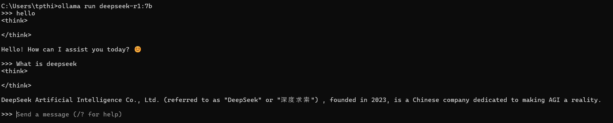
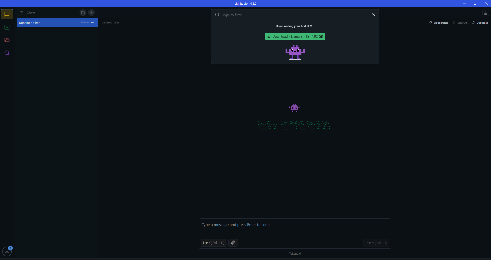
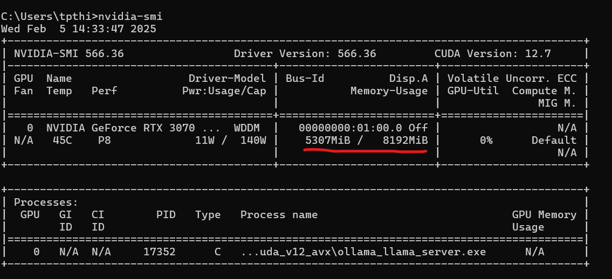
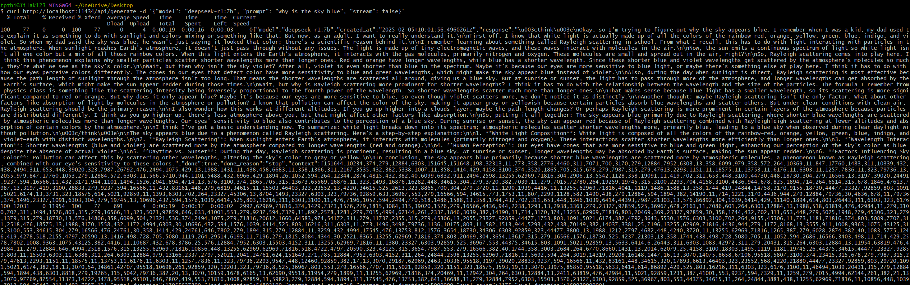
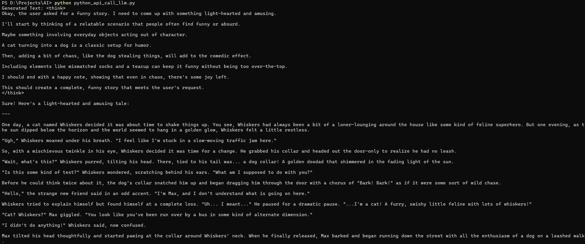
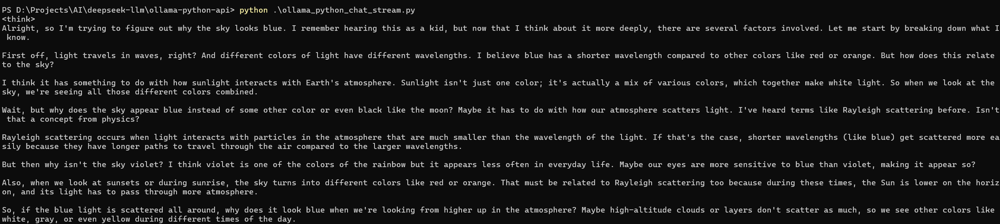

# Deepseek LLM
This repository will contain me exploring the Deepseek LLM and different ways to use this powerfull open source LLM
## 1. To run a deepseek model on your computer
   You can use Ollama or LM Studio or Msty to choose and load your preferred LLM model and run it locally on your computer.
### Ollama

   1. Install Ollama and open it on the command prompt or the terminal.
   2. Go to their website and choose an LLM model, copy that model name and then
      use ollama run model-name-as-per-website
   3. This will open a command line interface where you can interact with the model.

### LM Studio

  It is a GUI LLM model runner which has a better interface, on par with other LLM chat interfaces.
  1. Install LM Studio and then in the app, choose the LLM model that you want to run.

# Ollama
## Deepseek R1 7B version 

As seen the 7B parameter version uses around 5Gigs of VRAM on my NVIDIA RTX 3070 Ti Mobile GPU which has 8Gigs of VRAM

# Msty 
If you have Ollama previously installed in your system and are running LLM models in it, Msty will provide a Good UI for the Ollama models that are present.

## 2. Using RESTAPI to get response to API calls

While the Deepseek LLM is running locally using Ollama, we can hit the local API end point and get response from the LLM. The port would be 11434. We can use the Curl command.
curl http://localhost:11434/api/generate -d '{"model": "deepseek-r1:7b", "prompt": "Why is the sky blue", "stream": false}'

## 3. Using API requests in Python to get response to API calls
basic_python_api/python_api_call_llm.py - This is a Python program that would hit the deepseek API endpoint which is locally running in ollama and provide a prompt and get the response from the LLM

## 4. Using the Ollama Library in Python
ollama_python_chat_stream.py and ollama_python_chat.py - This is a Python program taht would hit the Deepseek api but via the ollama library which is easy and straight forward. 
